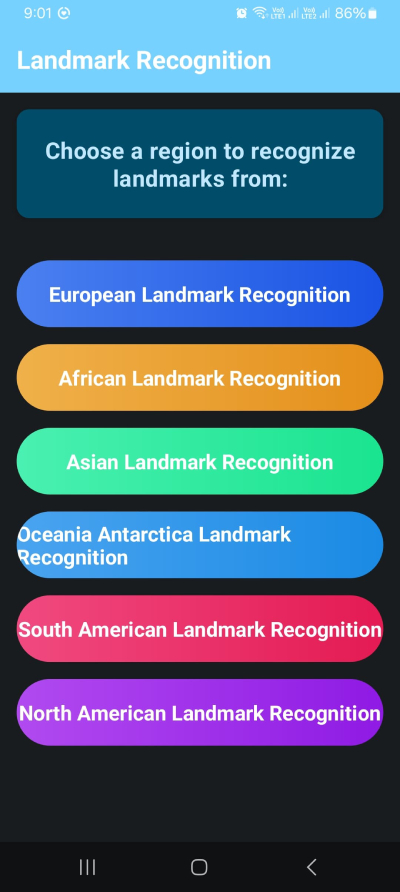
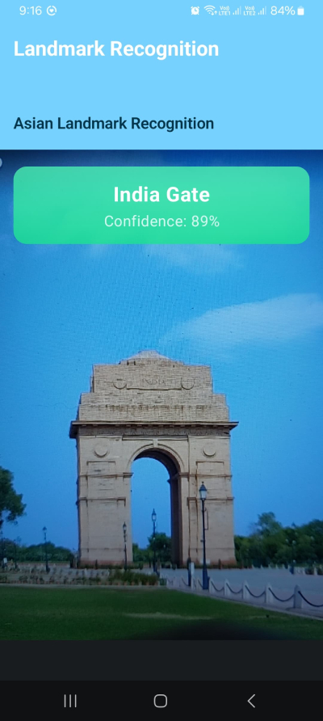
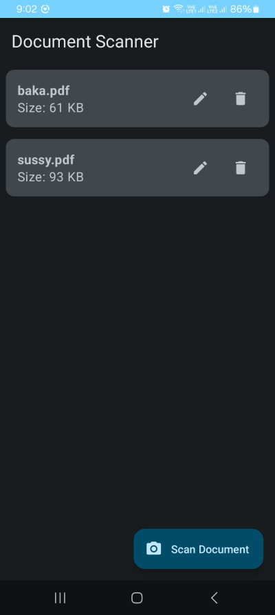

# ✨ MultiScan App: Your Intelligent Scanning and Recognition Companion 📸🌍

## 📑 Table of Contents
- [Welcome to MultiScan](#-welcome-to-multiscan-)
- [Core Capabilities](#-core-capabilities-what-multiscan-offers-you-)
- [Technology Stack](#-under-the-hood-a-glimpse-into-our-technology-stack-)
- [Architectural Blueprint](#-architectural-blueprint-designing-for-excellence-)
- [Application Flow](#-application-flow-how-multiscan-comes-to-life-)
- [Project Structure](#-project-structure-and-component-overview-developer-focused-)
- [Visual Showcase](#-visual-showcase-a-tour-through-multiscans-interface-)
- [Key Differentiators](#-key-differentiators-what-makes-multiscan-shine-)
- [Privacy & Security](#-our-commitment-to-your-privacy--security-)
- [Performance & Optimization](#-performance--optimization-a-smooth-experience-guaranteed-)
- [User Feedback and Error Handling](#-user-feedback-and-error-handling-keeping-you-informed-)
- [Accessibility Considerations](#-accessibility-considerations-striving-for-inclusivity-)
- [Potential Future Directions](#-potential-future-directions-the-road-ahead-)
- [Acknowledgements](#-acknowledgements-)
- [Get in Touch](#-get-in-touch--feedback-)

## 🚀 Welcome to MultiScan! 🚀

Embark on a journey of digital convenience and discovery with MultiScan! This isn't just another application; it's a sophisticated and intelligently designed Android companion, meticulously crafted to simplify your life and ignite your curiosity. We've poured our passion for cutting-edge technology and user-centric design into creating an app that seamlessly blends powerful document scanning capabilities with the magic of landmark recognition. 

MultiScan is built from the ground up using a modern Jetpack Compose user interface, ensuring a fluid, responsive, and visually delightful experience on your Android device. Under the hood, it harnesses the power of on-device TensorFlow Lite models, bringing you advanced machine learning features without compromising your privacy or needing a constant internet connection. Whether you're a student organizing notes, a professional managing documents, a traveler exploring new sights, or simply someone who appreciates elegant and functional technology, MultiScan is designed for you. Prepare to be amazed by its versatility and ease of use!

## 🎯 Core Capabilities: What MultiScan Offers You 🎯

MultiScan empowers you with two primary, exceptionally refined functionalities, making it an indispensable tool for a wide array of everyday tasks and exciting explorations:

*   **📄 Advanced Document Scanning & Management:** Say goodbye to cumbersome physical documents and hello to streamlined digital efficiency!
    *   **Crystal-Clear PDF Creation**: Effortlessly transform your physical papers, notes, receipts, sketches, or important documents into high-quality, professional-looking PDF files. Our scanning engine is optimized for clarity and readability.
    *   **Intelligent Edge Detection (via ML Kit)**: The integrated ML Kit Document Scanner intelligently detects document borders, automatically crops, and corrects perspective, ensuring you get perfect scans every time with minimal effort.
    *   **Effortless Document Organization**: Once scanned, your documents are not just saved; they are organized. MultiScan provides intuitive tools to view, rename, and delete your digital files directly within the app, keeping your digital workspace tidy.
    *   **Multi-Page Document Support**: Seamlessly scan multiple pages and consolidate them into a single, organized PDF document, perfect for reports, multi-page articles, or extensive notes.
    *   **Secure Local Storage**: All your scanned documents are stored securely on your device, giving you full control and accessibility whenever you need them, even offline.

*   **🏛️ Intelligent Landmark Recognition:** Explore and understand the world around you like never before!
    *   **Global Landmark Coverage**: Journey through continents with our specialized landmark recognition models. MultiScan can identify famous landmarks from various regions globally, including Africa, Asia, Europe, North America, Oceania/Antarctica, and South America.
    *   **Real-Time, On-Device Analysis**: Point your camera at a landmark, and MultiScan gets to work instantly. The recognition process happens in real-time, directly on your device, thanks to powerful TensorFlow Lite models.
    *   **Confidence Scoring**: For each recognized landmark, MultiScan provides a confidence score, giving you an indication of the AI's certainty in its identification. This transparency helps you gauge the accuracy of the results.
    *   **Offline Exploration**: Because the magic happens on your device, you don't need an internet connection to recognize landmarks. This makes MultiScan your perfect companion for travel and exploration, even in areas with limited connectivity.
    *   **Learn More About the World**: Discover the names of iconic structures and satisfy your curiosity about the man-made wonders that surround you.

## 🔧 Under the Hood: A Glimpse into Our Technology Stack 🔧

MultiScan stands on the shoulders of giants, utilizing a suite of modern Android development practices and robust technologies to deliver a seamless, powerful, and efficient application:

*   **🎨 User Interface Excellence with Jetpack Compose**: The entire user interface, every button, every list, every animation, is constructed using Jetpack Compose. This modern, declarative UI toolkit from Google allows for significantly less boilerplate code, a more intuitive development process, and the creation of beautiful, dynamic, and responsive user interfaces that feel natural and engaging. It enables us to build complex UIs with greater speed and maintainability.

*   **🧠 On-Device Machine Learning with TensorFlow Lite**: At the heart of our landmark recognition is TensorFlow Lite. This powerful framework allows us to deploy sophisticated machine learning models directly onto your device. The benefits are immense:
    *   **Privacy**: Your images and camera feed are processed locally, meaning sensitive data never leaves your device.
    *   **Speed**: On-device processing means low latency and real-time results.
    *   **Offline Access**: Recognition works perfectly even without an internet connection.
    *   **Efficiency**: TensorFlow Lite models are optimized for mobile hardware, ensuring they run smoothly without draining your battery excessively.
    We utilize a set of specialized models, each trained for specific geographical regions, ensuring higher accuracy and optimized performance by only loading the necessary classifier.

*   **📄 Seamless Document Scanning with Google's ML Kit**: For document scanning, we leverage Google's ML Kit Document Scanner API. This powerful library provides a streamlined, high-quality, and consistent document scanning experience. It handles the complexities of image capture, cropping, perspective correction, and image enhancement, allowing us to offer a top-tier scanning feature with great reliability.

*   **📷 Robust Camera Operations with CameraX**: Interfacing with the device camera can be complex, but CameraX, a Jetpack support library, simplifies this immensely. CameraX provides a consistent and easy-to-use API surface for camera operations across a wide range of Android devices. It's lifecycle-aware and handles many low-level details, allowing us to focus on building great camera-powered features like landmark recognition and document capture.

*   **📁 Efficient PDF Creation and Local Management**: Scanned documents are processed and converted into the universally compatible PDF format. These files are stored locally on your device, giving you complete ownership and control. The app includes functionalities to view these PDFs, rename them for better organization, or delete them when no longer needed.

## 🏗️ Architectural Blueprint: Designing for Excellence 🏗️

MultiScan adopts a well-defined, layered architecture to ensure a clear separation of concerns, enhance testability, promote maintainability, and allow for future scalability. This modular approach allows for independent development and evolution of different parts of the application, adhering to modern Android best practices.

*   **📱 Presentation Layer (UI)**: This is what you see and interact with. Built entirely with Jetpack Compose, it's responsible for rendering the UI and handling user input.
    *   **Composable Screens**: Each screen (Home, Document List, Camera View, etc.) is a collection of composable functions that reactively update to state changes.
    *   **State Management**: UI state is managed using Compose's state hoisting patterns, often driven by ViewModels, ensuring a predictable and manageable data flow.
    *   **User Interaction Handling**: Interactions are captured by composables and delegated to ViewModels or specific event handlers, keeping UI logic clean.

*   **🧠 Domain Layer (Business Logic)**: While often implicit in smaller apps, this conceptual layer contains the core business rules and use cases, independent of UI or data sources. For MultiScan, this includes the logic for deciding which landmark model to use or the rules for processing a scanned image.

*   **💾 Data Layer**: This layer is responsible for providing and managing all application data.
    *   **Repositories**: Abstracts data sources (e.g., `DocumentRepository` for PDFs, `LandmarkModelRepository` for ML models), providing a clean API to the rest of the app.
    *   **Data Sources**: Concrete implementations for accessing data, such as local file storage for PDFs and the Android Asset Manager for bundled TensorFlow Lite models.
    *   **Model Management**: Intelligent logic for selecting, loading, and unloading regional TensorFlow Lite classifiers to optimize memory usage and performance.

*   **🛠️ Core Components & Services**:
    *   **Navigation**: Jetpack Navigation Compose orchestrates the flow between different screens, defining a clear and predictable user journey.
    *   **Camera Integration**: A dedicated service manages camera permissions, configuration, and frame processing for both scanning and landmark recognition.
    *   **PDF Generation Engine**: A robust component for converting captured images into high-quality PDF documents.
    *   **TensorFlow Lite Interpreter**: The engine that runs the ML models, taking camera input and producing landmark classifications.

*   **🔗 Cross-Cutting Concerns**:
    *   **Permissions Handling**: A user-friendly and robust mechanism for requesting and checking runtime permissions (Camera, Storage), primarily managed in `MainActivity`.
    *   **Dependency Management Philosophy**: While not tied to a specific framework in this description, the architecture is designed to be compatible with dependency injection principles, promoting modularity and testability.
    *   **🌐 Seamless Localization**: MultiScan is designed with a global audience in mind. It supports multiple languages, with systems in place to detect and apply user-selected language preferences throughout the UI, ensuring a comfortable experience for users worldwide.

This layered and modular architecture ensures that MultiScan is not only feature-rich but also maintainable, scalable, and robust, providing a solid foundation for future enhancements and a consistently high-quality user experience.

## 🚦 Application Flow: How MultiScan Comes to Life 🚦

Ever wondered what happens when you tap the MultiScan icon? Here's a peek into the application's journey from launch to full interactivity, primarily orchestrated by its main entry point, `MainActivity`:

1.  **🚀 The Grand Launch: Ignition Sequence!**
    When you tap the MultiScan icon, the Android system springs into action, initiating the launch process. The first component to awaken is `MainActivity`, which serves as the primary window and the central nervous system for the application.

2.  **🎬 Setting the Stage: `MainActivity`'s Overture**
    Upon its creation, `MainActivity` doesn't just sit idle. It performs a series of critical setup tasks to prepare the app for you:
    *   **✨ Splash Screen**: A visually appealing splash screen is briefly displayed. This isn't just for show; it provides a smooth transition while the app initializes its core components in the background, ensuring a polished first impression.
    *   **🗣️ Language Configuration**: MultiScan respects your preferences! The app immediately checks for any previously saved user language settings. If found, it configures the locale, ensuring the entire interface is presented in your chosen language right from the start.
    *   **📸 Camera Permission Request**: Access to your device's camera is fundamental for MultiScan's magic. `MainActivity` proactively requests camera permission if it hasn't been granted already. The app is designed to handle this gracefully, informing you why the permission is needed if you choose to inquire.
    *   **🎨 UI Rendering with Jetpack Compose**: The heart of MultiScan's visual appeal lies in Jetpack Compose. `MainActivity` sets its content to a series of composable functions. These functions declaratively define the app's layout, apply the custom `MultiScanTheme` for consistent styling, and establish the overall navigation structure.
    *   **🗺️ Navigation Setup**: Getting around MultiScan is a breeze thanks to Jetpack Navigation Compose. Within `MainActivity`, the `AppNavHost` is configured. This component acts like a map, defining all possible navigation paths between different screens (like the Home screen, Document Scanner, Landmark Recognition settings, and various Camera views).
    *   **📦 ViewModel Access**: To manage data and state effectively, MultiScan uses ViewModels. Key ViewModels, such as `PdfViewModel` (which handles all your scanned document data), are initialized and made accessible to the relevant UI components, ensuring data consistency and separation of concerns.

3.  **🧭 Navigating the Experience: The User's Journey**
    *   Once initialized, you're typically greeted by an intuitive Home screen. This screen acts as your central hub, offering clear and inviting pathways to the Document Scanner and Landmark Recognition modules.
    *   As you interact with the app – perhaps selecting a continent for landmark recognition, capturing a document, or managing your saved PDF files – Jetpack Navigation seamlessly handles the transitions between screens. Behind the scenes, ViewModels diligently manage the underlying data, state changes, and business logic, ensuring a smooth and reactive experience.

4.  **🔄 Graceful Performance: Lifecycle and Responsiveness**
    `MainActivity`, in concert with other Android components and the Jetpack libraries, expertly manages the application's lifecycle. This means MultiScan responds correctly and gracefully to various system events, such as screen orientation changes, the app moving into the background, or being closed by the user. This meticulous lifecycle management contributes to a stable and reliable application.

This structured and thoughtful approach to application flow ensures a consistent, intuitive, and reliable user experience, from the very moment MultiScan is launched to the deepest interactions with its powerful features.

## 🛠️ Building and Running the Project: For the Curious Developer 🛠️

To build and run MultiScan, you'll need:

- Android Studio Arctic Fox (2020.3.1) or newer
- JDK 11 or higher
- An Android device or emulator running API level 23 (Android 6.0) or higher with camera support

The project uses Gradle for dependency management, with key configurations defined in the top-level and app-level build.gradle.kts files. Simply clone the repository, open it in Android Studio, sync Gradle files, and run on your device or emulator.

## 📂 Project Structure and Component Overview (Developer Focused) 📂

MultiScan follows a feature-based architecture that organizes code by functionality rather than technical layers. This makes the codebase more maintainable and easier to navigate for new developers.

### Core Components:

**Main Entry Point**
- **MainActivity**: The application's entry point that handles initialization, permission requests, and hosts the navigation system.

**Navigation System**
- **Navigation Component**: Defines all navigation routes between screens using Jetpack Navigation for Compose.

**User Interface Components**
- **Home Screen**: The main hub that provides access to the app's primary features.
- **Landmark Recognition UI**: Interface for selecting regions and viewing recognition results.
- **Document Scanner UI**: Interface for capturing, viewing, and managing documents.
- **Common Components**: Reusable UI elements like language selection dialogs and buttons.
- **Theme Definitions**: Styling, typography, and color schemes for consistent UI appearance.

**Landmark Recognition System**
- **Region Selection**: UI for choosing which geographical model to load.
- **Camera Integration**: Captures and processes camera frames for analysis.
- **TensorFlow Lite Models**: Region-specific models loaded based on user selection.
- **Results Processing**: Analyzes model outputs and displays recognition results.

**Document Processing System**
- **Document Scanner**: Integration with ML Kit for document edge detection and capture.
- **PDF Generation**: Converts captured images to PDF format.
- **Document Management**: Interface for viewing, renaming, and deleting saved PDFs.

**Data Management**
- **Database Components**: Room database for storing PDF metadata.
- **Repository Layer**: Abstracts data operations for documents and landmarks.
- **File Management**: Utilities for file operations and storage access.

**Utility Services**
- **Language Utilities**: Manages localization and language preferences.
- **Model Manager**: Handles TensorFlow model loading and lifecycle.
- **Permission Handling**: Manages runtime permissions for camera and storage.

This component-based view helps developers understand the functional areas of the application without getting lost in directory structures or file paths.

## 🖼️ Visual Showcase: A Tour Through MultiScan's Interface 🖼️

The application's user interface is meticulously designed for clarity, ease of use, and visual appeal. Here's what you can typically expect to see:

*   **🏠 The Home Screen: Your Command Center**

    

    This screen is your main entry point. It features large, clear buttons for "Document Scanner" and "Landmark Recognition," often accompanied by a welcoming message. It's designed to get you to your desired feature with a single tap.

*   **🌍 Landmark Recognition Options: Choose Your Adventure**

    

    Before you start recognizing landmarks, this screen allows you to select a continent or region (e.g., Asia, Europe). This optimizes the recognition process by loading the specific AI model trained for that area, leading to faster and more accurate results.

*   **🇮🇳 Landmark Recognition in Action: Witnessing AI Magic**

    

    This is where the magic happens! A live view from your camera as MultiScan successfully identifies a famous landmark (like India Gate, as depicted). The landmark's name is overlaid on the screen, along with the system's confidence level in the identification.

*   **📚 Document Scanner Interface: Your Digital Filing Cabinet**

    

    This screen displays a list of your previously scanned and saved PDF documents. It showcases how you can easily view, manage, rename, or delete your digital files, keeping everything organized and accessible within the app.

## 🌟 Key Differentiators: What Makes MultiScan Shine 🌟

In a world full of apps, MultiScan stands out. Here's why:

*   **🛡️ Privacy-First Design**: We fundamentally believe your data is yours. By performing all landmark recognition and document processing directly on your device, MultiScan ensures that your images and sensitive information never leave your phone or tablet unless you explicitly choose to share a generated PDF.
*   **🌐 True Offline Capability**: Whether you're on a plane, hiking in a remote area, or simply want to conserve data, MultiScan's core features work flawlessly offline. Landmark recognition and document scanning don't depend on an internet connection.
*   **⚡ Optimized Performance**: From quick app startup to real-time landmark identification and speedy PDF generation, MultiScan is engineered for efficiency. We achieve this through careful model selection, efficient coding practices, and leveraging the power of modern Android hardware.
*   **👌 Intuitive User Experience (UX)**: We've obsessed over the details to create an app that is not just powerful but also a joy to use. The Jetpack Compose UI is clean, modern, and responsive. Navigation is logical, and features are easy to discover and use, regardless of your technical proficiency.
*   **🎯 Region-Specific AI Models**: For landmark recognition, loading a massive global model can be slow and inefficient. MultiScan's approach of using smaller, region-specific models means faster loading times and often higher accuracy for the landmarks you're trying to identify.

## 🛡️ Our Commitment to Your Privacy & Security 🛡️

Your trust is paramount, and we take your privacy and security extremely seriously.

*   **🔒 On-Device Processing is Key**: The cornerstone of our privacy commitment is on-device processing. For landmark recognition, the images from your camera are analyzed locally. For document scanning, the images are processed and converted to PDF on your device. No image data for these core functions is sent to any external servers.
*   **✋ Transparent Permissions**: MultiScan only requests permissions that are absolutely necessary for its functionality. Camera access is needed for scanning and recognition. Storage access (scoped appropriately for modern Android versions) is needed to save your PDF documents. We believe in being transparent about why these permissions are required.
*   **📂 Secure Local Storage**: Your scanned PDF documents are stored in the application's private storage or a user-accessible location (depending on Android version and best practices), under your control. We do not access or transmit these files without your explicit action (e.g., if you use a share function).

## 📈 Performance & Optimization: A Smooth Experience Guaranteed 📈

We understand that a sluggish app is a frustrating app. That's why performance and optimization are at the forefront of MultiScan's development:

*   **🧠 Optimized Model Loading**: For landmark recognition, only the AI model for the selected region is loaded into memory. This significantly reduces memory footprint and speeds up the initialization of the recognition feature.
*   **💨 Efficient Resource Management**: The app is designed to be a good citizen on your device, managing resources like memory and CPU efficiently. This is crucial for maintaining responsiveness and extending battery life. CameraX and other Jetpack libraries help in managing resources tied to their components effectively.
*   **📱 Responsive Interface**: Thanks to Jetpack Compose and careful state management, the UI remains fluid and responsive, even during intensive operations like live camera analysis. We strive to minimize stutters and delays to provide a seamless interaction.
*   **⚡ Quick Startup**: We aim for a fast app launch so you can get to scanning or recognizing landmarks without unnecessary waiting. The initial splash screen helps mask any essential loading that needs to occur.

## 🗣️ User Feedback and Error Handling: Keeping You Informed 🗣️

A great user experience involves clear communication, especially when things don't go as planned.

*   **✅ Clear Guidance**: Throughout the app, we provide contextual information and guidance to help you use features effectively. This includes prompts for permissions or selection choices.
*   **💬 Informative Messages**: If an error occurs (e.g., a landmark isn't recognized, or a file operation fails), MultiScan aims to provide clear, understandable messages rather than cryptic error codes. We also guide you on potential next steps if applicable.
*   **👍 Constructive Feedback Loops**: For instance, the confidence score in landmark recognition is a form of feedback, helping you understand the AI's output. Permission requests are accompanied by explanations.

## ♿ Accessibility Considerations: Striving for Inclusivity ♿

While MultiScan is continually evolving, we are mindful of the importance of accessibility in software design. Our goal is to create an application that is usable by as many people as possible.

*   **Modern UI Toolkit**: Jetpack Compose, being a modern UI toolkit, has built-in support for many accessibility features provided by the Android platform. We aim to leverage these capabilities.
*   **Clear Visuals and Text**: We strive for clear fonts, adequate contrast (though this is an ongoing area of review), and intuitive layouts that are easier to understand and navigate.
*   **Descriptive Elements**: Where appropriate, UI elements are designed to be compatible with screen readers and other assistive technologies (a general aim of using standard Compose components).
*   **Ongoing Improvement**: Accessibility is an ongoing journey, and we are committed to learning and improving MultiScan's usability for everyone.

## 🚀 Potential Future Directions: The Road Ahead 🚀

MultiScan is a dynamic project, and we have a galaxy of ideas for making it even more powerful and indispensable! Here are some exciting potential enhancements we're dreaming about for the future:

*   **☁️ Cloud Sync & Backup Options (User-Opt-In)**: Imagine having the choice to securely back up your scanned documents to your preferred cloud storage provider, or even sync them across multiple devices. This would always be an opt-in feature, respecting your privacy choices.
*   **✏️ Advanced PDF Editing Features**: Beyond creation, we envision adding capabilities like annotating PDFs, adding signatures, reordering pages, or merging multiple PDF files directly within MultiScan.
*   **🌍 Expanded Landmark Database & Richer Details**: Continuously growing our database of recognizable landmarks and providing more detailed information about them – history, interesting facts, and maybe even links to relevant travel guides (user-initiated, of course).
*   **📸 Batch Scanning Enhancements**: Improving the workflow for scanning a large number of documents quickly and efficiently, perhaps with automatic batch naming or folder organization.
*   **🔍 OCR Text Extraction from Documents**: Adding the ability to perform Optical Character Recognition (OCR) on your scanned documents, making the text within them searchable, copyable, and editable. This would unlock a new level of document utility.
*   **🎨 Customizable Themes & Appearance**: Allowing you to personalize the look and feel of MultiScan with different themes, color palettes, or even a dark mode if not already fully implemented based on system settings.
*   **🗺️ Interactive Map View for Recognized Landmarks**: Visualizing your recognized landmarks on a map, creating a personal travel log of the places you've identified.
*   **🗣️ Voice Commands & Interaction**: Adding options for hands-free operation, such as initiating a scan or starting landmark recognition using voice commands.
*   **🤝 Enhanced Sharing Options**: More granular control over how and where you share your generated PDF documents, with direct integration to more services or apps.
*   **🤖 AI-Powered Document Tagging/Categorization**: Automatically suggesting tags or categories for your scanned documents based on their content to improve organization.

These are just some of the exciting possibilities! The future of MultiScan is bright, and we're eager to continue innovating.

## 🙏 Acknowledgements 🙏

MultiScan is built upon the incredible work of the open-source community and the powerful tools and libraries provided by Google and others. We extend our heartfelt gratitude to:

*   The **Android Jetpack team** for creating essential libraries like Compose, CameraX, Navigation, and ML Kit, which significantly accelerate development and improve app quality.
*   The **TensorFlow Lite team** for making on-device machine learning accessible and efficient.
*   The broader **Android development community** for their constant innovation, shared knowledge, and invaluable resources.

Without these foundational technologies and the spirit of collaboration, MultiScan would not be possible.

## 👋 Get in Touch / Feedback 👋

Your experience with MultiScan matters to us! While this README provides an overview, we understand you might have questions, suggestions, or feedback. As the app evolves, channels for feedback will become more formalized. For now, we encourage you to explore all the features and imagine the possibilities. We are passionate about making MultiScan the best it can be!

---
This detailed overview should provide a comprehensive understanding of MultiScan's capabilities, its underlying technology, how it operates, and its exciting potential. We hope you enjoy using MultiScan!

